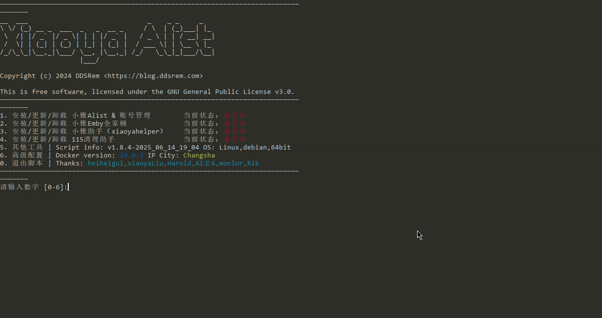
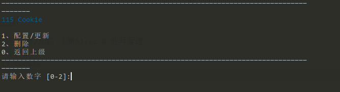
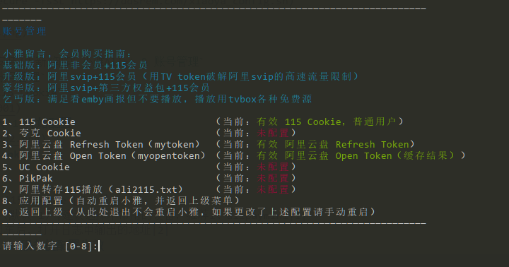

# 常用配置
## 1. 115 账号设置
**如果您`没有`115会员，不建议配置此项，因为115非会员的限制较多，极大概率无法正常使用。**
### 1.1. 进入`xiaoya-alist`的安装脚本页面。**必须使用root用户执行以下命令**：
```
bash -c "$(curl --insecure -fsSL https://ddsrem.com/xiaoya_config.sh)"
```


### 1.2. 输入`1`进入`安装/更新/卸载 小雅Alist & 账号管理`
### 1.3. 输入`4`进入`账号管理`
### 1.4. 输入`1`进入`115 Cookie`

### 1.5. 按照提示，输入`1`开始配置

### 1.6. 开始配置115 Cookie
|序号|配置项|说明|示例|
|-|-|-|-
|1|是否使用扫码自动获取 115 Cookie [Y/n]|-|y|
|2|请选择扫码绑定的设备（默认 1）|建议选择不常用的设备，推荐1、alipaymini|1|
|3|请选择扫码模式|请按回车后，打开日志中输出的地址|2|
### 1.7. 使用对应方式扫码获取115 Cookie
- 如果选择`设备 1`，请使用支付宝扫码
### 1.8. 完成后，输入8重启xiaoya-alist服务使配置生效
