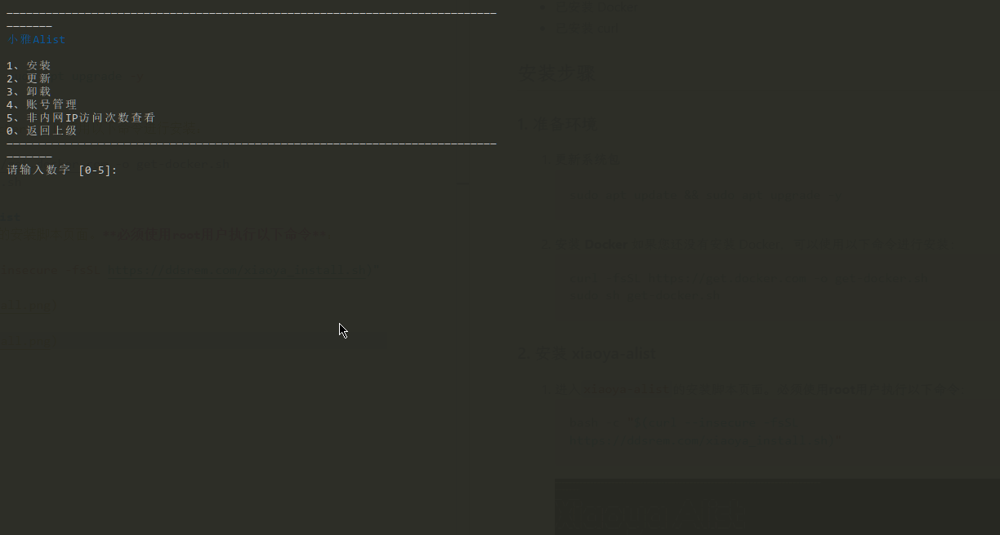
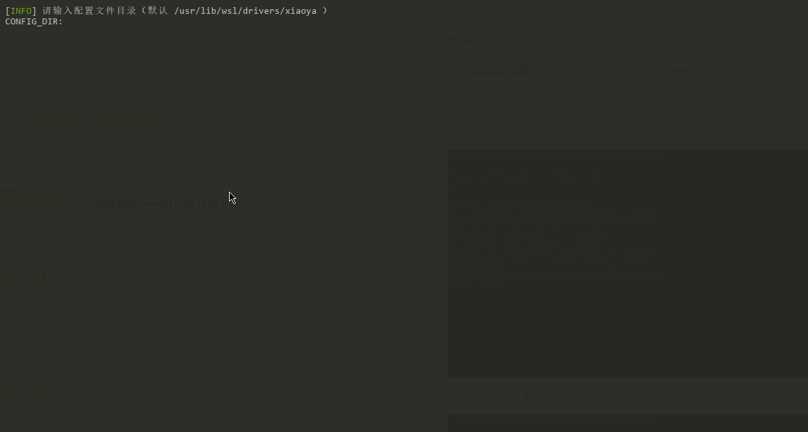
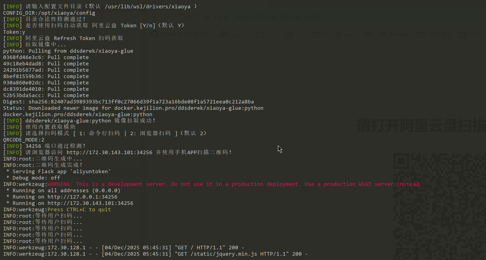
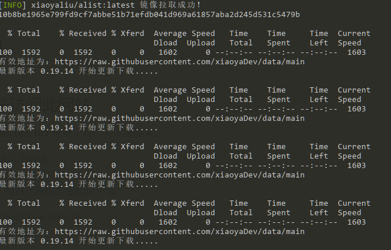

# 安装xiaoya-alist
本文档将指导您如何在您的服务器上安装和配置xiaoya-alist。
## 系统要求
- 操作系统：Linux（推荐使用Ubuntu或Debian）
- 已安装 Docker
- 已安装 curl
## 安装步骤
### 1. 准备环境
1. **更新系统包**
   ```bash
   sudo apt update && sudo apt upgrade -y
   ```
2. **安装 Docker**
   如果您还没有安装 Docker，可以使用以下命令进行安装：
   ```bash
   curl -fsSL https://get.docker.com -o get-docker.sh
   sudo sh get-docker.sh
   ```
### 2. 安装 xiaoya-alist
#### 2.1. 进入`xiaoya-alist`的安装脚本页面。**必须使用root用户执行以下命令**：
```bash
bash -c "$(curl --insecure -fsSL https://ddsrem.com/xiaoya_install.sh)"
```


#### 2.2. 按照提示，输入`1`


#### 2.3. 按照提示，输入`1`

#### 2.4. 根据提示输入配置项目
序号|配置项|说明|示例|
-|-|-|-
1|请输入配置文件目录|配置文件存放目录|/opt/xiaoya/config
2|是否使用扫码自动获取 阿里云盘 Token|-|y
3|请选择扫码模式|请按回车后，打开日志中输出的地址|2
4|是否使用扫码自动获取 阿里云盘 Open Token|-|y
5|请选择扫码模式 [ 1: 命令行扫码 | 2: 浏览器扫码 ]|请按回车后，打开日志中输出的地址|2
6|是否自动获取 阿里云盘转存目录 folder id|-|y
7|是否继续配置 PikPak 账号密码 |-|n
8|是否配置 夸克 Cookie |-|n
9|是否配置 UC Cookie |-|n
10| 是否配置 115 Cookie |-|n
11|是否配置 阿里转存115播放（ali2115.txt）|-|n
12|是否开启强制登入验证|-|y
13|请配置强制登入密码|-|此处输入您的强制登入密码
14|请再次输入密码进行验证|-|此处再次输入您的强制登入密码
15|是否使用host网络模式|-|n(推荐)



#### 2.5. 等待安装完成
安装过程可能需要几分钟时间，请耐心等待。安装完成后，您将看到


#### 2.6. 访问 xiaoya-alist
打开浏览器，访问 `http://<您的服务器IP>:5678`，即可进入